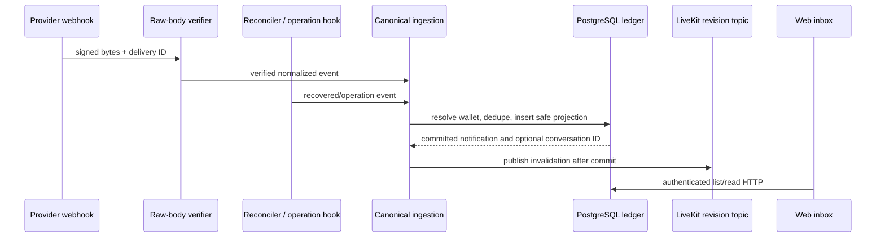

# Design: Durable wallet and assistant notifications

## Technical Approach

Add a PostgreSQL notification inbox and canonical ingestion service for operation lifecycle events, verified webhooks, and Solana history reconciliation. It resolves local wallet ownership and inserts a safe notification idempotently. Authenticated HTTP endpoints serve the feed. LiveKit remains an invalidation channel after commit; the browser reads durable state over HTTP.

## Architecture Decisions

| Decision | Choice | Alternatives and rationale |
|---|---|---|
| Source of truth | PostgreSQL ledger | LiveKit/process listeners are transient |
| Ingestion | Shared normalizer and DB dedupe | Separate writers risk semantic duplicates |
| Webhook verification | Verify raw bytes before parsing | Parsed-body verification can alter signed bytes |
| Recovery | Per-wallet cursor and bounded overlap | Webhook-only can miss delivery; balances do not identify events |
| UI delivery | HTTP feed and LiveKit invalidation | Native push is excluded; existing topic refreshes active sessions |
| Provider coverage | Enable verified embedded-wallet event types only | Server-wallet docs do not prove embedded-wallet coverage |

## Data Flow

The reconciler advances a wallet/network cursor only after canonical page events are durable. Dedupe chain events by network, local wallet, signature, and event class; dedupe webhook replays by provider/account and delivery ID. Bounded overlap makes insert-before-cursor crashes safe. A DB lease/advisory lock excludes duplicate wallet runs. Validate RPC retention and rate limits before rollout.

## File Changes

| File | Action | Description |
|---|---|---|
| `src/db/migrations/013_wallet_notifications.sql` | Create | Notification, receipt, cursor/lease schema and RLS |
| `src/notifications/*` | Create | Normalize, dedupe, feed, reconcile |
| `src/api/notifications.ts` | Create | Authenticated feed/read routes |
| `src/api/provider-webhooks.ts` | Create | Raw-body signature route |
| `src/server.ts` | Modify | Wire routes, hooks, lifecycle |
| `src/wallet/solana-devnet-provider.ts` | Modify | Confirmed history pages and cursors |
| `apps/nana-wallet/src/features/notifications/*` | Create | Feed query and UI |
| `apps/nana-wallet/src/lib/api.ts` and app navigation | Modify | Feed API and entry point |

## Interfaces / Contracts

- Feed responses contain notification ID, category/status, safe projection, timestamps, read state, and optional devnet explorer link.
- Replayed scoped webhook IDs are idempotent; invalid signatures cause no writes.
- Ingestion receives resolved internal `userId`/`walletId`; payloads cannot supply ownership.
- Cursor stores a network/signature boundary and uses bounded overlap, not time alone.

## Testing Strategy

| Layer | What to Test | Approach |
|---|---|---|
| Unit | Signature bytes, normalization, dedupe, safe projection, cursors | Vitest RED tests |
| Integration | RLS, replay, webhook/poll race, cursor failure, operation events | PostgreSQL with two users and fake sources |
| E2E | Transfer/inbound feed appears without reload; voice topic refreshes | Fastify inject + browser; fake provider, no funds |

## Threat Matrix

N/A — no routing to external shell commands, subprocesses, VCS automation, executable classification, or process integration is added. The reconciler performs bounded provider/RPC HTTP calls only.

## Migration / Rollout

Additive migration. Deploy schema/routes before ingestion. Start devnet reconciliation with bounded pages and observable cursors. Enable only verified embedded-wallet webhook types; polling remains recovery. Disable both sources to roll back without changing transfer authorization.

## Open Questions

- Verify Privy embedded-wallet event types, scope, finality, replay headers, and tenant configuration.
- Verify RPC retention, pagination, rate limits, polling interval, and overlap size.
- Confirm inbox placement and event grouping at outline review.
